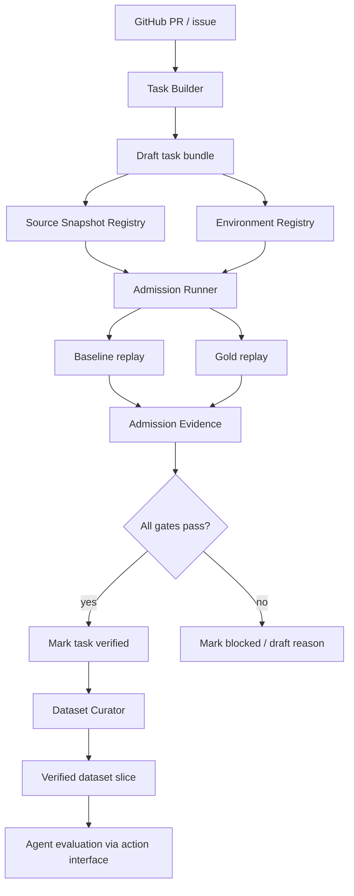

# OpBench v0.2 Design

日期：2026-05-25

## 1. 背景

OpBench v0.1 已经验证了一个最小闭环：一条真实 PyTorch task 可以携带 Docker runtime、source snapshot、hidden test、gold patch，并由真实 Codex CLI 通过 OpBench action interface 完成隔离修复和自动判分。

v0.1 的关键结论是：OpBench 的难点不只是让 agent 改代码，而是让真实算子问题在正确环境中稳定复现。算子问题常常依赖 framework version、package layout、backend behavior、hardware availability、numerical precision 和 source/runtime 之间的关系。如果数据集扩展后仍然依赖手工经验，环境问题会迅速成为 benchmark 的主要不稳定来源。

因此 v0.2 采用“任务驱动的平台化”路线：每加入一条真实 task，就把过程中暴露的 source、environment、admission、evidence 管理固化成系统能力。v0.2 不追求大规模数据量，而是交付一套后续可以持续扩展的数据构建和环境管理流程。

## 2. 目标

v0.2 的目标是把 OpBench 从 MVP 闭环推进到可扩展 benchmark 系统。

核心目标：

1. 构建 3-5 条 verified PyTorch operator-related tasks。
2. 建立标准 task admission pipeline，使 task 能从 draft 经过 replay evidence 晋升为 verified。
3. 建立 environment asset management，管理 Docker image、runtime tier、preflight、hardware requirement 和 cache state。
4. 建立 source snapshot management，记录 source snapshot 的来源、完整性、submodule 状态和适用范围。
5. 让 admission evidence 成为 dataset 的正式资产，而不是临时运行日志。
6. 保留 v0.1 已验证的 `codex_action_bridge` 评测路径，但 v0.2 不重点扩展多 agent。

## 3. 非目标

v0.2 不承诺以下能力：

1. 不做大规模 agent leaderboard。
2. 不把多 agent 对比作为主要交付；Claude Code、OpenHands、Aider 等放到后续版本。
3. 不要求大规模 CUDA/GPU 调度平台。
4. 不要求 C++/CUDA full source build 成为默认 verified task 路径。
5. 不追求 20+ verified tasks。
6. 不把环境失败计为 agent 失败；环境可用性仍然是 task admission 和 runner 调度问题。

## 4. 设计原则

### 4.1 任务驱动的平台化

v0.2 不先抽象一套空泛平台，再找 task 适配它。相反，每条新增 task 都必须走完整 admission 流程，并将过程中出现的环境、源码、测试和证据问题沉淀为可复用能力。

### 4.2 环境是数据的一部分

每条 task 必须能回答：

- 使用哪个 runtime environment？
- 该 environment 如何构建或获取？
- preflight 如何证明 environment 可用？
- 是否需要 GPU、CUDA、特定 CPU feature、特定 backend 或特定 package version？
- replay evidence 绑定的是哪个 environment artifact？

### 4.3 Evidence before verified

task 不能只靠人工判断标记为 `verified`。必须生成 admission evidence，并满足：

- baseline 能复现 fail-to-pass。
- baseline 的 pass-to-pass 不回归。
- gold patch 能通过 fail-to-pass。
- gold patch 不破坏 pass-to-pass。
- environment preflight 成功。
- source snapshot 和 runtime metadata 可追踪。

### 4.4 默认路径可本地复现

v0.2 可以设计 CUDA 或特殊硬件 tier，但默认 verified set 应优先选择可在常见本地 Docker CPU 环境中复现的 tasks。复杂环境必须有 manifest 和 admission 状态，但不强制所有复杂 tier 都在 v0.2 跑通。

## 5. v0.2 范围

### 5.1 Dataset Scope

首个扩展目标仍聚焦 PyTorch：

- verified tasks：3-5 条。
- draft/candidate tasks：允许更多，但不进入正式评分。
- task 类型优先级：
  - Python-level operator/module behavior bug。
  - CPU package runtime 可复现的问题。
  - 不需要 full PyTorch source build 的 operator-related issue。
  - 少量复杂环境 candidate 可进入 draft，但不能影响默认 verified experiment。

### 5.2 Agent Scope

v0.2 继续使用 v0.1 的 `codex_action_bridge` 作为参考真实 agent path。

新增重点不是接入更多 agent，而是保证更大的 verified dataset 能被现有 agent runner 稳定评测。多 agent 对比进入 v0.3 或后续版本。

## 6. Runtime Tier

v0.2 引入 runtime tier，用于描述 task 的环境复杂度和默认可执行范围。

| Tier | 名称 | 含义 | v0.2 状态 |
| --- | --- | --- | --- |
| T0 | `cpu_python_overlay` | 使用 installed wheel，agent 修改 source snapshot 中的 Python 文件，测试前 overlay 到 runtime package | 必须支持，默认 verified 主路径 |
| T1 | `cpu_package_runtime` | 使用 CPU Docker image 和 installed package，但可能需要额外 dependency、env vars、pytest args 或 package layout | 应支持，作为 v0.2 扩展重点 |
| T2 | `cpu_source_snapshot_fuller` | 需要更完整 source snapshot 或部分 submodule，但不涉及 CUDA/GPU | 设计并部分支持，是否 verified 取决于 task admission |
| T3 | `cuda_declared` | task 需要 CUDA/GPU 或特定 accelerator | 支持 manifest、preflight 和 skip reason；不作为 v0.2 默认 verified 要求 |
| T4 | `hardware_specific` | 依赖特定硬件、driver、backend 或 vendor stack | 只进入 metadata 设计，不要求实现完整调度 |

runtime tier 的目的不是降低标准，而是让 task 的可执行条件显式化。一个 T3 task 如果当前机器没有 GPU，应输出 `environment_unavailable` 或 `hardware_unavailable`，不能混入 agent failure。

## 7. 核心模块设计

### 7.1 Task Builder

Task Builder 负责从真实 PR/issue 生成 draft task bundle。

输入：

- GitHub PR URL。
- optional issue URL。
- base commit。
- gold patch source。
- candidate test patch。
- framework name。
- initial runtime tier。

输出：

- `tasks/<framework>/<task_name>/task.json`
- `issue.md`
- `artifacts/gold.patch`
- `artifacts/test.patch`
- draft metadata

Task Builder 的边界：

- 它只负责构建候选任务，不负责保证任务 verified。
- 它可以半自动生成 bundle，但允许人工修正 `issue.md`、test patch、pass-to-pass tests。
- 它必须记录 source PR、issue、commit 和 patch provenance。

### 7.2 Admission Runner

Admission Runner 是 v0.2 的核心。它负责把 draft task 变成 verified task，或者给出明确失败原因。

Admission Runner 流程：

1. validate task manifest。
2. resolve source snapshot。
3. resolve environment artifact。
4. run environment preflight。
5. prepare baseline workspace。
6. apply hidden test patch。
7. run baseline fail-to-pass / pass-to-pass。
8. prepare gold workspace。
9. apply hidden test patch and gold patch。
10. run gold fail-to-pass / pass-to-pass。
11. write admission evidence。
12. update task admission status only if all gates pass.

Admission status：

| Status | 含义 |
| --- | --- |
| `candidate` | 仅收集到 PR/issue，还没有完整 task bundle |
| `draft` | task bundle 已存在，但尚未通过 replay admission |
| `blocked_environment` | task 逻辑可能有效，但当前 environment 无法准备或不满足硬件要求 |
| `blocked_source` | source snapshot 不完整或无法 checkout |
| `blocked_test` | hidden test 或 pass-to-pass test 本身不稳定 |
| `not_reproduced` | baseline 无法复现 fail-to-pass |
| `gold_failed` | gold patch 无法 resolved |
| `verified` | baseline/gold replay 全部通过，可进入正式 benchmark |

### 7.3 Environment Registry

Environment Registry 管理可复用 runtime artifacts。

建议新增 registry manifest：

```text
environments/registry.json
```

每个 environment artifact 包含：

- environment id。
- framework。
- runtime tier。
- Docker image name。
- tag。
- optional digest。
- Dockerfile path。
- build context。
- Python version。
- framework/package version。
- required hardware。
- preflight commands。
- preflight workdir。
- supported source loading modes。
- cache policy。

示例字段：

```json
{
  "id": "pytorch-cpu-torch2.6.0-py311",
  "framework": "pytorch",
  "runtime_tier": "cpu_python_overlay",
  "docker": {
    "image": "op-bench/pytorch-cpu:torch2.6.0-py311",
    "digest": null,
    "dockerfile": "environments/pytorch-cpu/Dockerfile",
    "build_context": "environments/pytorch-cpu"
  },
  "python": "3.11",
  "packages": {
    "torch": "2.6.0"
  },
  "hardware": {
    "requires_gpu": false,
    "cuda": null
  },
  "preflight": {
    "workdir": "/tmp",
    "commands": ["python -c \"import torch; print(torch.__version__)\""]
  },
  "source_loading_modes": ["python_overlay"]
}
```

Task manifest 可以继续保留必要 environment 字段，但应逐步改为引用 environment registry id，并允许 task-level overrides。

### 7.4 Source Snapshot Registry

v0.1 的 source snapshot 位于本地 cache，文档解释其 submodule 不完整。v0.2 应将 snapshot 变成可追踪资产。

建议新增 registry manifest：

```text
.op_bench_cache/sources/registry.json
```

或者输出到可提交的 metadata：

```text
runs/sources/<snapshot_id>.json
```

每个 source snapshot 包含：

- snapshot id。
- repo URL。
- commit SHA。
- local path。
- creation time。
- checksum 或 file manifest summary。
- submodule policy。
- submodule status。
- source loading modes supported。
- related tasks。

submodule policy：

- `none_required`：当前 task 不依赖 submodule。
- `partial`：只准备部分 submodule。
- `full`：完整初始化 submodule。
- `unknown`：不允许 verified task 使用。

### 7.5 Admission Evidence

Admission evidence 是 task verified 的依据。建议每次 admission run 生成：

```text
runs/admission/<task_id>/<timestamp>/evidence.json
runs/admission/<task_id>/<timestamp>/baseline.log
runs/admission/<task_id>/<timestamp>/gold.log
runs/admission/<task_id>/<timestamp>/environment.json
runs/admission/<task_id>/<timestamp>/source.json
```

`evidence.json` 应包含：

- task id。
- task manifest hash。
- source snapshot id。
- environment id。
- environment digest 或 image id。
- runtime tier。
- baseline status。
- gold status。
- fail-to-pass results。
- pass-to-pass results。
- command durations。
- failure classification。
- created_at。
- admission decision。

Dataset manifest 中不应只写 `admission_status=verified`，还应引用最近一次 verified evidence：

```json
{
  "task_id": "pytorch__149693__lazylinear_init",
  "path": "../../tasks/pytorch/149693_lazylinear_init",
  "admission_status": "verified",
  "admission_evidence": "runs/admission/pytorch__149693__lazylinear_init/2026-05-25/evidence.json"
}
```

如果不希望 dataset 引用 `runs/` 下的临时路径，也可以将 stable evidence summary 放入 task bundle：

```text
tasks/<framework>/<task>/admission/evidence.json
```

v0.2 推荐采用 task-local stable evidence summary，完整日志仍写入 `runs/admission/`。

### 7.6 Dataset Curator

Dataset Curator 负责维护 dataset slice。

职责：

- 将 verified task 加入 dataset。
- 保留 draft task 但默认不参与 `--verified-only`。
- 输出 dataset summary。
- 检查 task status 与 evidence 是否一致。
- 检查 environment id 和 source snapshot id 是否可解析。

输出示例：

```text
datasets/pytorch_mini_v0.2/dataset.json
datasets/pytorch_mini_v0.2/summary.json
datasets/pytorch_mini_v0.2/README.md
datasets/pytorch_mini_v0.2/README.zh-CN.md
```

## 8. 数据流



## 9. CLI 设计

v0.2 应尽量复用现有 scripts，但要让流程更明确。

### 9.1 Build Draft Task

```bash
PATH=.venv/bin:$PATH PYTHONPATH=src python scripts/build_task_from_pr.py \
  --pr-url https://github.com/pytorch/pytorch/pull/<id> \
  --output tasks/pytorch/<task_name> \
  --framework pytorch \
  --runtime-tier cpu_python_overlay
```

该命令生成 draft bundle，不标记 verified。

### 9.2 Prepare Source Snapshot

```bash
PATH=.venv/bin:$PATH PYTHONPATH=src python scripts/prepare_source_snapshot.py \
  --task tasks/pytorch/<task_name> \
  --snapshot-registry .op_bench_cache/sources/registry.json \
  --output runs/sources/<task_id>.json
```

v0.2 需要增强该命令，使其输出 snapshot id、commit、submodule status 和 supported loading modes。

### 9.3 Prepare / Validate Environment

```bash
PATH=.venv/bin:$PATH PYTHONPATH=src python scripts/prepare_environment.py \
  --task tasks/pytorch/<task_name> \
  --environment-registry environments/registry.json \
  --output runs/env/<task_id>.json
```

该命令应输出 image id、digest、preflight result 和 hardware availability。

### 9.4 Run Admission

建议新增：

```bash
PATH=.venv/bin:$PATH PYTHONPATH=src python scripts/run_admission.py \
  --task tasks/pytorch/<task_name> \
  --output-dir runs/admission/<task_id>/<timestamp>
```

可选参数：

- `--update-task-status`
- `--write-task-evidence`
- `--allow-hardware-unavailable`
- `--strict`

### 9.5 Curate Dataset

建议新增：

```bash
PATH=.venv/bin:$PATH PYTHONPATH=src python scripts/curate_dataset.py \
  --dataset datasets/pytorch_mini_v0.2/dataset.json \
  --include-verified-only \
  --write-summary
```

## 10. Task Manifest Changes

v0.2 应保持向后兼容 v0.1 task manifest，但增加以下概念：

```json
{
  "environment_ref": "pytorch-cpu-torch2.6.0-py311",
  "runtime_tier": "cpu_python_overlay",
  "source_ref": "pytorch-<commit>-snapshot",
  "admission": {
    "status": "verified",
    "evidence": "admission/evidence.json",
    "verified_at": "2026-05-25T00:00:00Z"
  }
}
```

兼容策略：

- 如果 task manifest 仍使用 v0.1 inline environment 字段，系统继续支持。
- 如果存在 `environment_ref`，优先从 registry 解析，再应用 task-level overrides。
- `admission.status` 与 dataset entry 的 `admission_status` 必须一致，否则 validation failed。

## 11. Evaluation Changes

v0.2 的 agent evaluation 不需要改变核心判分标准：

- fail-to-pass 必须通过。
- pass-to-pass 不能回归。
- agent patch 必须在 fresh workspace 中评分。
- agent 必须通过 action interface。

但 run result 需要记录更多环境和 admission metadata：

- environment id。
- runtime tier。
- source snapshot id。
- admission evidence id。
- Docker image id / digest。
- hardware availability。
- action log path。
- environment failure classification。

这样后续分析 agent 失败时，可以区分：

- task 本身 admission 不稳定。
- 当前机器环境不满足。
- source snapshot 不完整。
- agent patch 无效。
- agent 超时或 action bridge 失败。

## 12. Candidate Task Selection Strategy

v0.2 目标是 3-5 条 verified tasks，因此建议准备 8-12 条 candidates，从中筛选通过 admission 的任务。

筛选标准：

1. 来自真实 PyTorch issue/PR。
2. 问题与 operator、module、dispatch、shape、dtype、precision、backend 或 lazy behavior 相关。
3. PR patch 不应过大，优先选择局部修复。
4. 测试可以提取为 hidden test patch。
5. 优先可在 CPU Docker 环境中复现。
6. 不依赖私有数据、外部服务或长时间训练。

候选任务分类：

- Python module/operator behavior。
- dtype / precision edge case。
- shape inference / lazy module behavior。
- CPU backend behavior。
- package/runtime behavior。
- CUDA-only candidate，暂不作为默认 verified 目标。

## 13. 验收标准

v0.2 完成时应满足：

1. 至少 3 条、最多 5 条 PyTorch tasks 标记为 verified。
2. 每条 verified task 都有 task-local admission evidence summary。
3. 每条 verified task 都能通过 `run_admission.py` 重新生成 baseline/gold evidence。
4. dataset validation 能检查 task status、evidence、environment ref、source ref。
5. environment registry 能列出 v0.2 使用的 Docker runtimes。
6. source snapshot metadata 能说明 commit、submodule policy 和适用 task。
7. `run_experiment.py --verified-only --agent codex_action_bridge` 能在 v0.2 dataset 上运行。
8. 文档说明新增 task、环境准入、source snapshot、dataset curate 的完整流程。
9. 单元测试覆盖 registry 解析、admission decision、dataset validation 和关键 CLI。

## 14. 风险与应对

| 风险 | 影响 | 应对 |
| --- | --- | --- |
| 找到的 PR 难以稳定复现 | verified 数量不足 | 准备 8-12 条 candidates，目标只要求 3-5 条 verified |
| PyTorch source snapshot 不完整 | C++/CUDA/build task 无法 admission | v0.2 默认 verified 仍以 T0/T1 为主；T2/T3 先做 manifest 和 blocked reason |
| Docker image 本地 tag 不可复现 | 不同机器 replay 不一致 | environment registry 记录 image id/digest；后续版本接 registry push/pull |
| hidden test patch 不稳定 | admission 假阳性或假阴性 | Admission evidence 记录 fail-to-pass 和 pass-to-pass 细节；不稳定 task 保持 draft |
| 过早抽象复杂环境平台 | 开发周期失控 | 采用任务驱动平台化，只实现 verified tasks 真正需要的能力 |
| CUDA task 诱惑导致范围扩大 | v0.2 被 GPU 调度拖慢 | CUDA 只做 declared tier 和 skip classification，不作为默认验收 |

## 15. 推荐实施顺序

1. 定义 environment registry 和 source snapshot metadata schema。
2. 增强 task/dataset validation，使其理解 admission evidence。
3. 实现 `run_admission.py`，先覆盖 v0.1 verified task。
4. 将 v0.1 task 迁移到 v0.2 admission evidence 格式。
5. 准备 8-12 条 PyTorch candidate PR。
6. 逐条构建 draft task bundle。
7. 逐条运行 admission，筛选 3-5 条 verified tasks。
8. 建立 `datasets/pytorch_mini_v0.2`。
9. 使用 `codex_action_bridge` 在 verified dataset 上跑一次小规模评测。
10. 更新 README、developer guide、manual validation 和 v0.2 experiment report。

## 16. 版本结论

OpBench v0.2 的重点不是单纯扩大数据集，而是建立可以持续扩大数据集的系统能力。它应交付一批更有代表性的 verified operator tasks，同时让每条 task 的环境、源码、准入证据和评测结果都可追踪、可复现、可审计。

