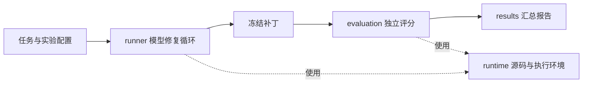

# 架构导读

OpBench 的主流程是：**给模型一道算子修复题，让它使用固定工具修改源码，再独立评价提交的补丁。** 本文按这个流程介绍代码。安装与运行入口见[项目说明](../README.zh-CN.md)，具体配置字段见[任务格式](v0.8/task_format.md)和[实验配置](v0.8/agent_integration.md#实验配置与运行)。

## 先分清三个输入

| 输入 | 描述什么 | 示例 |
| --- | --- | --- |
| 任务 `task.json` | 一道题的题面、源码位置、环境、公开测试和私有评分要求 | [LayerNorm 候选任务](../datasets/v0.8_candidates/layer_norm_cpu/task.json) |
| 数据集 `dataset.json` | 本次可选的一组任务及其标识 | [候选数据清单](../datasets/v0.8_candidates/dataset.json) |
| 实验 `experiment.json` | 用哪些模型解哪些题，采用什么工具预算和运行模式 | [配置格式](v0.8/agent_integration.md#实验配置与运行) |

任务包可以包含源码、公开测试、私有评分文件和用于开发检查的参考补丁，但模型只获得公开部分。模型输出的是工具调用决定；OpBench 执行这些调用，并在求解结束时收集源码改动为 `patch.diff`。最终分数来自独立评分，而不是模型的完成声明或公开测试输出。
公开题面通过最初的模型请求传入，并保存为 `task_input.json`；工作区内只保留公开提交规则 `submission-policy.json`。

## 一次 run 的路线



1. `cli.py` 解析 `opbench run`，交给 `runner/experiment.py`。后者读取配置、生成任务与模型的运行计划，并通过 `preparation.py` 准备任务快照和可复用的未修复构建基线。
2. `runner/attempt.py` 管理单次求解的工作区、执行与记录。`runner/loop.py` 负责对话和预算，`model_client.py` 调用选定模型，`mcp.py` 将模型的工具选择交给 `tools.py` 执行，再把公开反馈交回循环。
3. 求解结束后，`runtime/submission.py` 从工作区收集补丁。`evaluation/evaluator.py` 在独立评分工作区应用该补丁、构建并执行测试。评分不会再询问模型，也不会把私有测试结果送回这次求解。
4. `results/records.py` 读取并核验保存的评分证据，`results/report.py` 按计划汇总 `resolved_rate`。实验结束后可重新生成报告，也可重新评价同一补丁，而不重新调用模型。

固定循环和工具共同构成当前的 Agent 执行框架。不同模型走同一流程；当前不允许每个模型自己选择 shell、网络搜索或另一套 Agent 框架。
模型客户端只转换模型协议；任务与评分不依赖模型供应商。后续比较 Agent 框架时，
由框架适配器接入求解阶段，具体职责见[接入边界](v0.8/agent_integration.md#benchmarkagent-与模型的职责)。

## 代码按职责放置

所有活动代码位于 [`src/op_bench/`](../src/op_bench/)，按下面五个模块组织。`cli.py` 是用户入口，根目录的 `io.py`、`provenance.py` 提供文件读写和来源信息等共用功能。

| 模块 | 职责 | 主要文件 |
| --- | --- | --- |
| [`data/`](../src/op_bench/data/) | 解析任务与数据集，校验声明，区分任务公开信息与评分配置 | `task.py`、`dataset.py` |
| [`runner/`](../src/op_bench/runner/) | 编排实验，调用模型，执行固定工具循环，保存求解过程 | `experiment.py`、`attempt.py`、`preparation.py`、`loop.py`、`model_client.py`、`tools.py`、`mcp.py` |
| [`runtime/`](../src/op_bench/runtime/) | 准备源码、管理本机或 Docker 会话、复用构建基线、收集提交补丁 | `execution.py`、`workspace.py`、`baseline.py`、`snapshot.py`、`provisioning.py`、`submission.py` |
| [`evaluation/`](../src/op_bench/evaluation/) | 构建和评价补丁，执行评分控制组，核验或重放评分结果 | `evaluator.py`、`judgment.py`、`numeric.py`、`variants.py`、`controls.py`、`verification.py`、`replay.py` |
| [`results/`](../src/op_bench/results/) | 读取尝试记录，判断结果是否可用于统计，生成报告 | `records.py`、`report.py` |

几个容易混淆的边界：

- **`runner` 与 `runtime`**：前者决定下一次询问模型什么、调用哪个工具；后者只负责源码和命令在哪里、如何执行，不调用模型。
- **公开测试与最终评分**：公开测试属于求解反馈，由 `runner/tools.py` 调用；最终评分属于 `evaluation`，使用冻结补丁和任务声明的私有评分要求。
- **执行评分与读取证据**：`evaluator.py` 启动构建与评分，`verification.py` 只读已保存的证据；二者共用 `judgment.py` 和 `numeric.py` 的判定规则。核验模块不依赖执行器，报告不另写一套评分规则。
- **实验准备与基线内部格式**：`runner/preparation.py` 决定准备什么、何时恢复；`runtime/baseline.py` 负责基线构建与复制时的路径重定位。实验编排不修改基线内部记录。
- **`controls.py` 与数据准入**：它实现 `check-task`，用空补丁、正确补丁、替代解和错误补丁检查评分是否合理。命令把控制组计划、结果和错误保存在 `controls.json`，不分配数据准入状态。完整的数据选择与准入流程将在 v0.9 完善。
- **MCP 与工具实现**：`mcp.py` 提供工具协议，`tools.py` 定义工具行为，`_workspace_tools.py` 在任务环境内执行文件操作。当前循环使用进程内的 MCP 传输，不需要额外部署工具服务。

依赖方向保持明确：`runtime` 使用 `data`；`evaluation` 使用 `runtime` 和 `data`；`results` 读取记录时使用 `evaluation/verification.py` 核验评分证据；`runner` 编排上述模块。共用的环境与工作区约定放在 `runtime/workspace.py`，避免环境模块反向调用评分器。报告生成不会启动模型或执行候选程序。

这五个目录是同一个 Python 程序的职责分组，不是五个独立服务。数据、求解、评分、报告是四项业务职责，`runtime` 是求解和评分共用的执行能力。独立评分可以不启动模型，报告可以不启动任务环境；这两条边界有实际用途。没有必要再加接口层、服务注册或插件框架。

`run` 统一维护实验计划、准备与恢复；开发评分器可用 `evaluate --task ... --patch ...` 单独评价补丁。循环与工具执行器共用参数校验，整批参数先检查，再执行动作。

运行、准备和评分入口的输出目录在写入前共用 `TaskSpec.validate_output_path` 检查：输出不能位于题目源码或私有测试目录中，符号链接也按解析后的实际位置判断，避免运行产物污染后续任务输入。`report` 则在已有运行目录中重算并写入 `report.json`，不创建新的执行工作区。

完整评分保存在 `evaluation/result.json`，尝试与重放记录只关联该文件。`attempt.json` 通过 `harness_path` 关联
`harness/harness-result.json`，不重复内嵌循环结果或用量。实验结束、中断和 `report` 命令共用 `results.report.summarize_run`；运行中持续保存单题记录，需要进度时再汇总。报告是派生数据，同补丁重评则保存原因和独立结果，原尝试及评分不被覆盖。

多环境变体和控制组采用同样原则：`evaluation_path` 指向独立的 `result.json` 文件，
父记录只保留计划、路径与状态，不复制子评分详情。历史字段别名由 `results/records.py`
在读取时归一，统计代码只使用当前字段。多环境能力保留，但当前测试夹具与候选任务均未启用。

## 最短代码阅读顺序

第一次读实现，沿一条任务路径阅读即可，无需先读完全部设计和验证文档：

1. [`data/task.py`](../src/op_bench/data/task.py)：一题包含什么，哪些字段可以给模型看。
2. [`runner/experiment.py`](../src/op_bench/runner/experiment.py) 和 [`runner/attempt.py`](../src/op_bench/runner/attempt.py)：实验如何排定与恢复，一次求解如何保存补丁并交给评分器。
3. [`runner/loop.py`](../src/op_bench/runner/loop.py) 和 [`runner/tools.py`](../src/op_bench/runner/tools.py)：模型每一轮如何行动。
4. [`evaluation/evaluator.py`](../src/op_bench/evaluation/evaluator.py)：补丁如何被判定为解决或未解决。
5. [`results/report.py`](../src/op_bench/results/report.py)：单次结果如何成为整体成绩。

需要追查环境启动、命令超时或补丁遗漏时，再进入 `runtime`；需要新增模型接入时，再进入 `model_client.py`。命令到功能的映射集中在 [`cli.py`](../src/op_bench/cli.py)。

## 结果在哪里

一次 `opbench run --output runs/v0.8/validation/quickstart-r1/example` 的主要输出如下，具体日志目录随任务和模型后端变化：

```text
runs/v0.8/validation/quickstart-r1/example/
├── plan.json                         # 任务、模型、预算与计划
├── report.json                       # 当前汇总成绩与完成状态
├── inputs/                           # 本次使用的任务快照和基线
└── attempts/
    └── attempt-000001/
        ├── task_input.json           # 给模型的公开任务
        ├── attempt.json              # 阶段状态、提交状态与循环/评分文件路径
        ├── patch.diff                # 结束时保存的补丁
        ├── harness/
        │   ├── trajectory.jsonl      # 模型决策、工具反馈、结束原因
        │   └── harness-result.json   # 循环完成情况与用量
        ├── tool-logs/                # 工具日志
        └── evaluation/
            └── result.json           # 独立评分结果
```

先看 `report.json` 了解实验是否完成、各模型解决多少题；再看对应 `attempt.json` 判断是求解失败还是环境故障；最后沿轨迹、工具日志和评分结果定位原因。完整评分只存在 `evaluation/result.json`，读取接口可将它附在返回值中，但不会回写一份副本。输出目录会保存私有评分材料，不能直接作为模型可见的输入目录。

项目自己的运行记录按 `runs/<版本>/<validation或experiments>/<批次>/` 保存；旧记录
按版本归档，构建缓存单独保存。具体目录与查阅入口见[运行记录](../runs/README.md)。

主指标是 `resolved_rate = resolved / planned`。每模型每道逻辑题一次求解；要求的评分变体需要全部通过。缺失和故障保留在计划分母中并单独计数，`complete=false` 表示不能将这份进度报告当成完整实验比较。详细口径见[计分规则](v0.8/statistical_protocol.md)。

## 改动应放在哪里

| 想扩展的内容 | 改动位置与验证方式 |
| --- | --- |
| 新增算子题或任务分类 | 编写任务包与数据集清单，使用 `check-task` 检查评分；现有评分类型足够时不改核心代码 |
| 使用另一个已兼容的模型服务 | 修改实验配置中的 `models`，保留相同工具、提示与预算 |
| 接入新的模型 API | 扩展 `runner/model_client.py`，验证响应解析、错误和时间限制 |
| 增减工具 | 修改 `runner/tools.py` 和需要的工作区操作，验证权限与实际行为；这是实验条件变化，应记录工具版本 |
| 支持新的运行环境 | 扩展 `runtime`，验证执行、停止、工作区捕获和独立评分可用性 |
| 新增评分方式 | 扩展 `data` 的声明与 `evaluation` 的执行、核验逻辑；用正确解和错误解检验判定 |
| 分析模型行为 | 后续基于已保存的轨迹和结果实现；当前不把分析逻辑混入求解或评分 |

当前 controlled 模式使用断网 Docker 工作区，模型服务和凭据留在控制器；development 模式在本机执行，便于调试，但不具备相同隔离。私有评分方式也有不同的信任条件，详见[信息边界](v0.8/information_boundary.md)。

本文描述当前代码，接口变更见 [CHANGELOG](../CHANGELOG.md)。历史设计和实验经过保留在[版本记录](history/README.md)，按当时版本阅读；本次迭代的详细约定与验证见 [v0.8 文档入口](README.zh-CN.md)。
