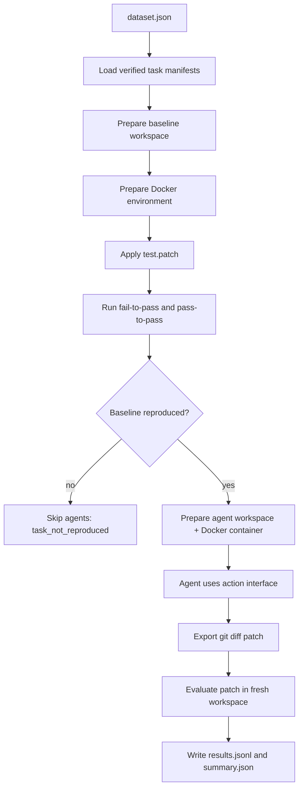

# OpBench v0.1 开发者指南

本文面向第一次接触 OpBench 的开发者，解释项目模块职责、数据流和常用操作。根目录 README 只保留最短入口；需要改代码、加数据集或接入新 agent 时，先读本文。

## 1. v0.1 正式边界

v0.1 只承诺以下正式能力：

- 使用两层数据集结构管理真实任务：`dataset.json` 选择 task bundle，task bundle 声明源码、环境、测试和 patch。
- 使用 Docker 作为真实算子任务的运行环境载体。
- 使用 source snapshot 避免评测热路径依赖大型上游仓库在线 clone。
- 使用 evaluator 自动判定 baseline、gold 和 agent patch。
- 使用 action interface 隔离 agent 与目标仓库。
- 使用 `codex_action_bridge` 跑通真实 Codex CLI agent。

不属于 v0.1 正式能力：

- 任意模型直连 loop。
- 让 agent 直接进入 Docker 或直接修改 host 上的目标仓库。
- CUDA、多 GPU、C++/CUDA kernel rebuild 任务。
- 大规模任务调度和远程 Docker image registry 管理。

## 2. 核心概念

### Task Bundle

单条 benchmark 任务，位于 `tasks/<framework>/<task_name>/`。

典型内容：

- `task.json`：结构化 manifest。
- `issue.md`：给 agent 看的问题描述。
- `artifacts/test.patch`：评测时注入的 hidden/benchmark tests。
- `artifacts/gold.patch`：来自真实 PR 的参考修复。

Task 必须回答四个问题：

- 从哪里拿源码？
- 用什么环境运行？
- baseline 应该失败哪些测试？
- patch 成功后哪些测试必须通过且不能回归？

### Dataset Manifest

数据集切片，位于 `datasets/<slice>/dataset.json`。

它不复制 task 内容，只记录 task 路径和准入状态。正式实验应使用 `--verified-only`，只运行 admission_status 为 `verified` 的任务。

### Environment Artifact

环境 artifact 位于 `environments/`，当前 v0.1 是 `environments/pytorch-cpu/`。

环境不是说明文档，而是 task 可执行依赖的一部分。Docker-backed task 会声明：

- image tag
- Dockerfile/build context
- preflight commands
- workspace mount path
- preflight workdir

### Source Snapshot

PyTorch 这类仓库太大，在线 clone 不适合作为每次评测的热路径。v0.1 支持在 `.op_bench_cache/sources/...` 中准备本地 source snapshot，然后每次 replay 复制 snapshot 到 workspace。

当前 v0.1 snapshot 是 PyTorch superproject 的源码快照，不保证包含所有 git submodule 内容。也就是说，`third_party/FP16`、`third_party/pybind11`、`third_party/onnx` 等目录可能只有 submodule 占位目录而没有完整文件。这对当前 verified task 不构成影响，因为该任务使用 `python_overlay`，只依赖 `torch/nn/modules/linear.py` 和 `test/nn/test_lazy_modules.py`，测试运行依赖 Docker image 中已经安装好的 PyTorch wheel。

但这也是一个明确边界：任何需要 C++/CUDA 编译、native extension、third_party source 或完整 submodule 的任务，不能直接复用当前 snapshot 策略。此类任务进入数据集前必须补充完整 submodule snapshot，或改用 full source build / pinned artifact 方案，并通过 replay evidence 证明环境和源码完整。

### Source Loading

v0.1 的 verified PyTorch task 使用 `python_overlay`：agent 看到 full repo，修改 Python source file；测试运行时只把指定 overlay 文件同步到容器内已安装 PyTorch wheel 的 runtime overlay 目录。这样避免完整源码构建 PyTorch。

## 3. 代码模块职责

| 模块 | 职责 |
| --- | --- |
| `src/op_bench/task.py` | 读取和封装单条 `task.json`，提供路径、环境、测试命令等访问方法。 |
| `src/op_bench/dataset.py` | 读取 `dataset.json`，按 `--verified-only` 过滤并加载 task。 |
| `src/op_bench/environment.py` | 准备运行环境；Docker task 会 inspect/build image、启动 task-scoped container、运行 preflight、清理容器。 |
| `src/op_bench/executor.py` | 本地命令和 Docker 命令执行器，统一返回 `CommandResult`。 |
| `src/op_bench/source_loading.py` | 生成 source overlay 同步命令。 |
| `src/op_bench/evaluator.py` | 核心判分器；执行 baseline/gold/agent patch，分类结果状态。 |
| `src/op_bench/actions.py` | 标准 workspace action interface，限制 agent 文件访问范围并封装命令/测试/diff。 |
| `src/op_bench/action_bridge.py` | 文件队列 action bridge；把外部 agent 的 CLI 调用转成 OpBench actions，并记录 action log。 |
| `src/op_bench/agents.py` | agent adapter；v0.1 正式真实路径是 `codex_action_bridge`。 |
| `src/op_bench/reporter.py` | 写入 `results.jsonl` 和聚合 `summary.json`。 |
| `src/op_bench/progress.py` | 终端进度日志格式化。 |

## 4. 实验数据流



注意：agent 生成 patch 和 patch 判分使用不同 workspace。这样可以避免 agent 的中间状态污染最终评分。

## 5. 结果状态

| 状态 | 含义 |
| --- | --- |
| `baseline_reproduced` | 原始代码能复现 fail-to-pass 失败，且 pass-to-pass 通过。 |
| `baseline_not_reproduced` | 任务当前不可准入；不能用于正式评测。 |
| `resolved` | patch 修复所有 fail-to-pass，且 pass-to-pass 没有回归。 |
| `fail_to_pass_failed` | patch 没修复目标失败。 |
| `pass_to_pass_regressed` | patch 修复或未修复目标问题，但破坏了已有行为。 |
| `environment_unavailable` | 当前机器无法准备 task 声明环境；这是调度失败，不是 agent 失败。 |
| `environment_error` | 测试阶段出现导入、动态库、CUDA 等环境错误。 |
| `agent_runtime_unsupported` | 所选 agent 不能满足当前 task 的运行边界。 |

## 6. 常用命令

校验数据集：

```bash
PATH=.venv/bin:$PATH PYTHONPATH=src python scripts/validate_dataset.py \
  datasets/pytorch_mini/dataset.json
```

准备环境：

```bash
PATH=.venv/bin:$PATH PYTHONPATH=src python scripts/prepare_environment.py \
  --task tasks/pytorch/149693_lazylinear_init \
  --output runs/env/pytorch_149693.json
```

准备 source snapshot：

```bash
PATH=.venv/bin:$PATH PYTHONPATH=src python scripts/prepare_source_snapshot.py \
  --task tasks/pytorch/149693_lazylinear_init \
  --output runs/sources/pytorch_149693.json
```

验证 task replay：

```bash
PATH=.venv/bin:$PATH PYTHONPATH=src python scripts/verify_task_replay.py \
  tasks/pytorch/149693_lazylinear_init \
  --output runs/replay/pytorch_149693.json
```

运行正式 v0.1 agent 实验：

```bash
PATH=.venv/bin:$PATH PYTHONPATH=src OP_BENCH_CODEX_TIMEOUT_SEC=1200 python scripts/run_experiment.py \
  --dataset datasets/pytorch_mini/dataset.json \
  --verified-only \
  --agent codex_action_bridge \
  --output-dir runs/pytorch-mini-codex-action-bridge
```

## 7. 如何新增一条任务

1. 从真实 issue/PR 选择候选任务。
2. 使用 `scripts/build_task_from_pr.py` 生成 draft bundle，或手动创建 task bundle。
3. 补全 `task.json` 中的 environment、source snapshot、source loading、fail-to-pass、pass-to-pass。
4. 编写 `artifacts/test.patch`，只包含评测所需测试。
5. 确认 `artifacts/gold.patch` 来自真实 PR 的最小修复。
6. 运行 `scripts/validate_task.py`。
7. 运行 `scripts/verify_task_replay.py`。
8. 只有 baseline 为 `baseline_reproduced` 且 gold 为 `resolved` 时，才能把 task 和 dataset entry 标记为 verified。

## 8. 如何接入新 Agent

新 agent 不应直接修改目标 workspace，也不应绕过 Docker runtime。推荐路径：

1. Host 侧保留模型调用、认证和 agent 控制逻辑。
2. 给 agent 一个 scratch workspace。
3. 暴露一个 action bridge，让 agent 只能通过 `read_file`、`write_file`、`apply_patch`、`run_command`、`run_test`、`git_diff` 操作目标仓库。
4. 所有命令和测试必须通过 `WorkspaceActions` 进入 task executor。
5. 最终 patch 必须由 action interface 的 `git_diff` 导出。
6. 结果 metadata 应记录 action count、action log path、runtime boundary 和完整性状态。

`codex_action_bridge` 是当前参考实现。接入 Claude Code、OpenHands 或其他 agent 时，优先复用这个边界，而不是新增模型直连 loop。

## 9. 当前 v0.1 限制

- Verified dataset 目前只有一条 PyTorch CPU task。
- 第二条 PyTorch task 仍是 draft，需要完成 replay admission。
- Docker image 目前依赖本地 tag；后续需要 registry 和 digest pinning。
- Source snapshot 位于本地 cache，不提交到 git；后续需要正式 artifact 管理。
- 当前 verified task 限制为 Python-level overlay，不覆盖 C++/CUDA rebuild。
